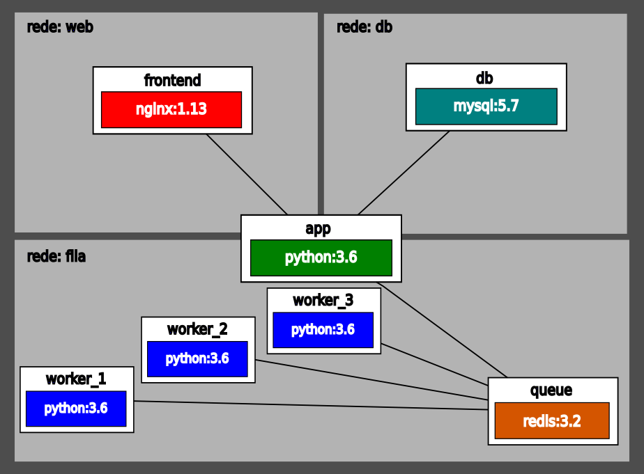

# Projeto para envio de e-mails com workers

## Exemplo completo de uma aplicação com múltiplos serviços em docker.

Aplicação realizada durante o meu aprendizado de Docker seguindo os passos da seguinte apostila: [Curso de Docker](apostila-docker.pdf)

### Componentes
- Servidor _web_
- Banco de dados
- Gerenciamento de filas
- _Workers_ para envio de e-mail (escalável)
- Aplicação principal



### Testando

Com o Docker instalado e funcionando em sua máquina, para colocar a aplicação em funcionamento é preciso criar um arquvio  `.env` na raiz do projeto com os seguintes parâmetros:
```
MYSQL_ROOT_PASSWORD=
DB_NAME=
DB_HOST=
DB_USER=
REDIS_HOST=
DB_PORT=
```
Depois basta rodar o `./run.sh`, e a aplicação pode ser acessada no seu `localhost`
